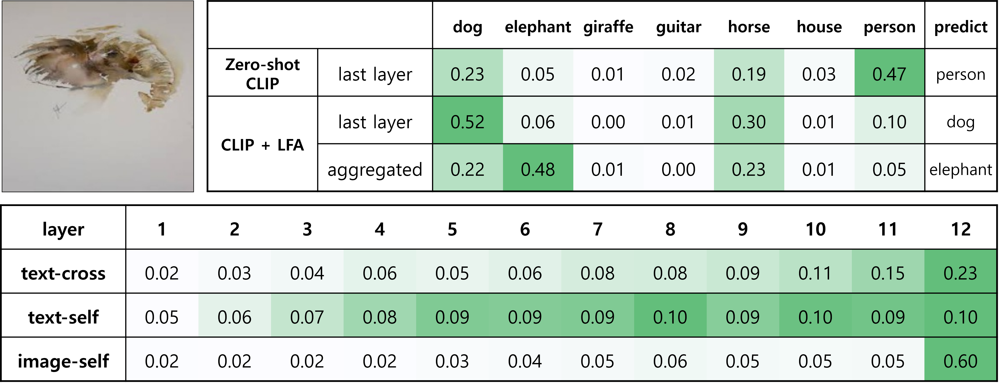
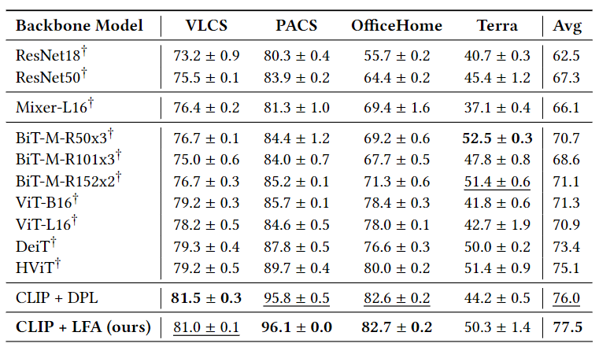

<!-- # LFA: Layer-wise Features Aggregation for Efficient Transfer Learning

Executable code for "Layer-wise Features Aggregation for Efficient Transfer Learning (LFA)"

In this study, we propose a novel approach called Layer-wise Feature Aggregation (LFA), which utilizes features from all layers of a pre-trained model with instance-specific importance.
First, LFA captures hierarchical features from low-level to high-level, enabling the extraction of richer and more general features; therefore, it significantly improves the performance in domain shift and few-shot learning. 
Second, LFA requires optimization only on top of large pre-trained models. Therefore, LFA optimization is efficient because it does not require back-propagation through the model. 
LFA is a new efficient transfer learning approach with improved performance and efficiency. 

---
# Approach


---
# Main Contributions
- We introduce the Layer-wise Feature Aggregation (LFA) method, a novel approach that significantly mitigates the computational burdens commonly associated with the fine-tuning of pre-trained models.
- We empirically validate that the LFA method excels in handling both domain and distribution shifts, thereby establishing its versatility and applicability for a broad spectrum of machine learning tasks.
- We establish the critical importance of our holistic aggregation approach by validating its efficacy across a various experiments.

---
# Results



The Zero-shot CLIP model incorrectly predicts the elephant picture above as a human with a 47\% probability. As a result of applying our methodology to the pre-trained CLIP model, we observed that the activation proportion for each attention layer in both encoders are highest in the last layer, as indicated in the table below. However, utilizing only the last layer in the CLIP + LFA model, which is similar to fine-tuning a new classification layer on the last layer, leads to an incorrect prediction of `dog' with a probability of approximately 52\%. When aggregating features from all layers, the model correctly predicts an elephant with a 48\% probability.



The best scores are bolded, and the second-best scores are underlined. CLIP + LFA demonstrates superior performance compared to DPLCLIP, DeiT, and HViT across VLCS, PACS, and OfficeHome datasets. Additionally, the average of our results showcases the best overall performance.

--- -->
# Usage

## Installation

### Python libraries
- install pytorch library ([pytorch page link](https://pytorch.org/))
- install requirements
```sh
pip install -r requiremnets.txt
```

## Data preparation

### Domainbed benchmark datasets for Domain Generalization(DG) tasks
> 💡 This paragraph for has been borrowed directly from [DPLCLIP's](https://github.com/shogi880/DPLCLIP/blob/master/README.md) official repository.

```sh
python -m domainbed.scripts.download --data_dir=/my/datasets/path --dataset pacs
```
Note: change `--dataset pacs` for downloading other datasets (e.g., `vlcs`, `office_home`, `terra_incognita`). 

### 11 datasets for Few-shot tasks
> 💡 This paragraph for has been borrowed directly from [CoOp's](https://github.com/KaiyangZhou/CoOp/blob/main/DATASETS.md) official repository.

Please follow the instructions at [DATASETS.md](docs/DATASETS.md) to prepare all datasets.

## Training and Evaluation

### Domain Generalization(DG)
Please follow the instructions at [README.md](domain_generalization/readme.md) for training or evaluation.

### Few-shot 
Please follow the instructions at [README.md](few_shot/readme.md) for training or evaluation.

---
# Acknowledgement

- Thanks for open-sourse codebase from [DPLCLIP](https://github.com/shogi880/DPLCLIP).
- Thanks for open-sourse codebase from [MaPLe](https://github.com/muzairkhattak/multimodal-prompt-learning).

---
# Citation
If you use our work, please consider citing:
```

```
