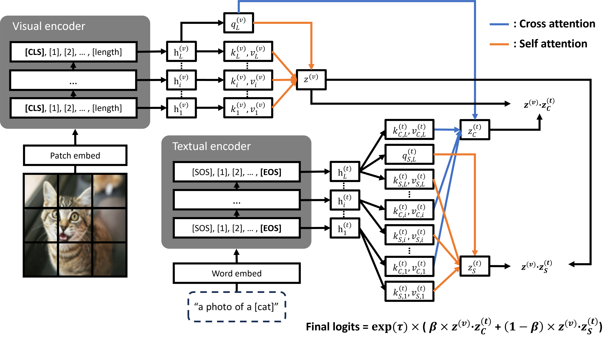
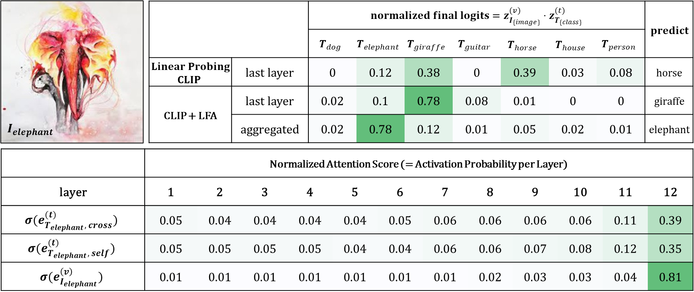
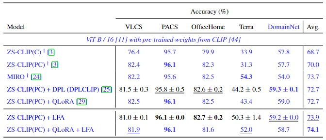
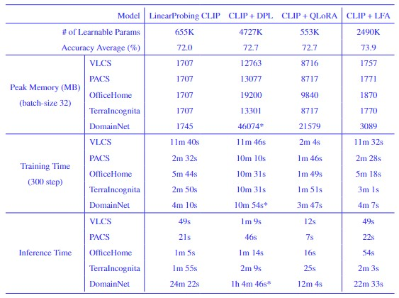

# LFA: Efficient Transfer Learning driven by Layer-wise Features Aggregation

Executable code for "Efficient Transfer Learning driven by Layer-wise Features Aggregation"

In this study, we propose a novel approach called Layer-wise Feature Aggregation (LFA), which utilizes features from all layers of a pre-trained model with instance-specific importance.
First, LFA captures hierarchical features from low-level to high-level, enabling the extraction of richer and more general features; therefore, it significantly improves the performance in domain shift and few-shot learning. 
Second, LFA requires optimization only on top of large pre-trained models. Therefore, LFA optimization is efficient because it does not require back-propagation through the model. 
LFA is a new efficient transfer learning approach with improved performance and efficiency. 

---
# Approach



---
# Main Contributions
- We introduce the Layer-wise Feature Aggregation (LFA) method, a novel approach that significantly mitigates the computational burdens commonly associated with the fine-tuning of pre-trained models.
- We empirically validate that the LFA method excels in handling both domain and distribution shifts, thereby establishing its versatility and applicability for a broad spectrum of machine learning tasks.
- We establish the critical importance of our holistic aggregation approach by validating its efficacy across a various experiments.

---
# Results



The image depicts an elephant from the PACS dataset. but the LinearProbing CLIP model misclassifies it as a horse. Observing the activation proportion when applying our methodology, we note that the last layer exhibits the highest activation. However, a model utilizing only the features of the last layer classifies this picture as a giraffe, correctly predicting it as an elephant only when all layers are used.



The best scores are bolded, and the second-best scores are underlined. CLIP + LFA demonstrates superior performance compared to DPLCLIP, DeiT, and HViT across VLCS, PACS, and OfficeHome datasets. Additionally, the average of our results showcases the best overall performance.



\* indicates that experiments were conducted with a batch size of 8 due to memory constraints. In our model with LFA, peak memory usage is slightly higher than LinearProbing CLIP but still lower than CLIP + DPL and CLIP + QLoRA. Despite the trainable parameters, training and inference times remain as short as those of LinearProbing CLIP, demonstrating that our model is both lightweight and efficient while improving generalization performance.

---
# Usage

## Installation

### Python libraries
- install pytorch library ([pytorch page link](https://pytorch.org/))
- install requirements
```sh
pip install -r requiremnets.txt
```

## Data preparation

### Domainbed benchmark datasets for Domain Generalization(DG) tasks
> 💡 This paragraph for has been borrowed directly from [DPLCLIP's](https://github.com/shogi880/DPLCLIP/blob/master/README.md) official repository.

```sh
python -m domainbed.scripts.download --data_dir=/my/datasets/path --dataset pacs
```
Note: change `--dataset pacs` for downloading other datasets (e.g., `vlcs`, `office_home`, `terra_incognita`). 

### 11 datasets for Few-shot tasks
> 💡 This paragraph for has been borrowed directly from [CoOp's](https://github.com/KaiyangZhou/CoOp/blob/main/DATASETS.md) official repository.

Please follow the instructions at [DATASETS.md](docs/DATASETS.md) to prepare all datasets.

## Training and Evaluation

### Domain Generalization(DG)
Please follow the instructions at [README.md](domain_generalization/readme.md) for training or evaluation.

### Few-shot 
Please follow the instructions at [README.md](few_shot/readme.md) for training or evaluation.

---
# Acknowledgement

- Thanks for open-sourse codebase from [DPLCLIP](https://github.com/shogi880/DPLCLIP).
- Thanks for open-sourse codebase from [MaPLe](https://github.com/muzairkhattak/multimodal-prompt-learning).

---
# Citation
If you use our work, please consider citing:
```

```
